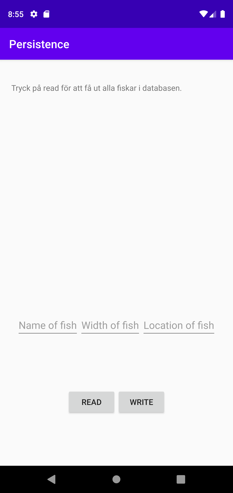
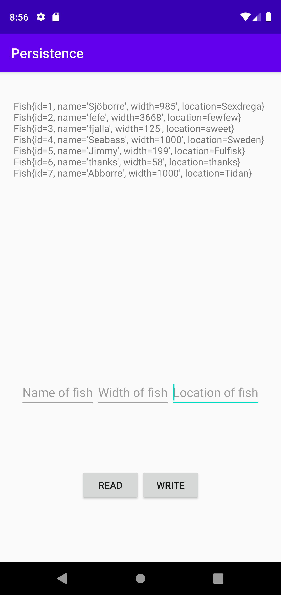
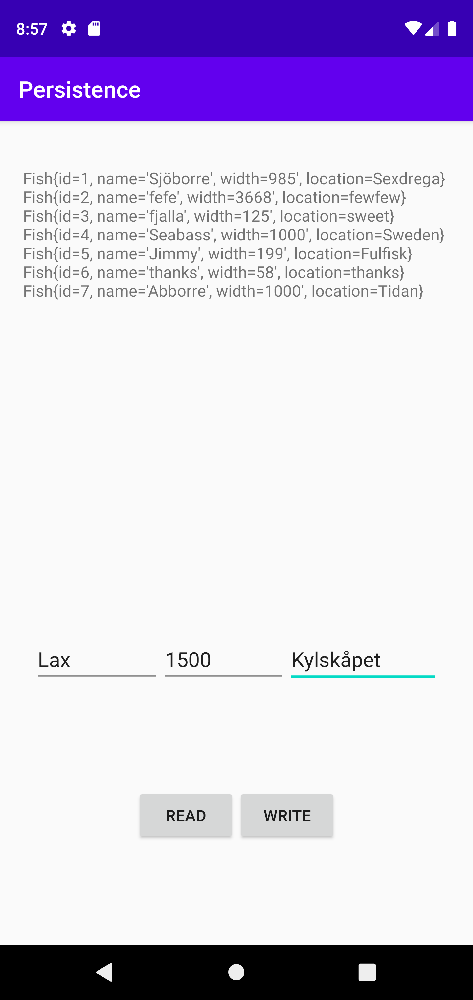

# Rapport

**Skriv din rapport här!**

Uppgiften gick ut på att skapa en app som lagrar en tabell med flera rader i en SQLite fil.

Generellt är det inget konstigt med layouten på appen. Flera vyer användes för att kunna åstadkomma resultatet. Det som skall skrivas ut lagras i en TextView. Det fanns redan färdiga klasser att använda för att skapa tabeller och databasen. 

```Java
public class DatabaseHelper extends SQLiteOpenHelper {
class DatabaseTables {
```
Här finns statiska konstanter för att lägga till och anropa korrekt data och för att inte det ska skickas in fel värden vid anrop eller inserts. Dessa modifierades endast för att lägga till annat än berg. I detta fallet fiskar.

```Java
    static class Fish {
        //VConstants that is same as fish-properties.
        static final String TABLE_NAME = "fish";
        static final String COLUMN_NAME_ID = "id";
        static final String COLUMN_NAME_NAME = "name";
        static final String COLUMN_NAME_WIDTH = "width";
        static final String COLUMN_NAME_LOCATION = "location";
    }

    static final String SQL_CREATE_TABLE_FISH =
            // "CREATE TABLE mountain (id INTEGER PRIMARY KEY, name TEXT, height INT)"
            "CREATE TABLE " + Fish.TABLE_NAME + " (" +
                    Fish.COLUMN_NAME_ID + " INTEGER PRIMARY KEY," +
                    Fish.COLUMN_NAME_NAME + " TEXT," +
                    Fish.COLUMN_NAME_WIDTH + " INT," +
                    Fish.COLUMN_NAME_LOCATION + " TEXT)";

    static final String SQL_DELETE_TABLE_FISH =
            // "DROP TABLE IF EXISTS mountain"
            "DROP TABLE IF EXISTS " + Fish.TABLE_NAME;
```
Här är en tabell för fiskar i klassen DatabasHelper. Fish är en statisk innerklass.

```Java
    private static final int DATABASE_VERSION = 1; // If this is incremented onUpgrade() will be executed
    private static final String DATABASE_NAME = "Fishes.db"; // The file name of our database

    DatabaseHelper(Context context) {
        super(context, DATABASE_NAME, null, DATABASE_VERSION);
    }

    // This method is executed only if there is not already a database in the file `Mountain.db`
    @Override
    public void onCreate(SQLiteDatabase sqLiteDatabase) {
        sqLiteDatabase.execSQL(DatabaseTables.SQL_CREATE_TABLE_FISH);
    }

    // This method is executed only if the database version has changed, e.g. from 1 to 2
    @Override
    public void onUpgrade(SQLiteDatabase sqLiteDatabase, int oldVersion, int newVersion) {
        sqLiteDatabase.execSQL(DatabaseTables.SQL_DELETE_TABLE_FISH);
        onCreate(sqLiteDatabase);
    }
```

Funktionerna är självbeskrivande. Enda ändringen är att det skapas en databas som heter Fishes istället för Mountain.

I klassen Fish så läggs relevant data till för fiskar som användaren får fylla i och som kommer lagras i databasen och matchas med tabellen i databasen så samma data lagras i både ett fisk objekt och en tabell. Så när man hämtar data från filen sätts det till nya fiskobjekt med korrekt värden.

```Java
    private List<Fish> getFish() {
        Cursor cursor = database.query(DatabaseTables.Fish.TABLE_NAME, null, null, null, null, null, null);
        List<Fish> fishList = new ArrayList<>();
        while (cursor.moveToNext()) {
            Fish fish = new Fish(
                    cursor.getLong(cursor.getColumnIndexOrThrow(DatabaseTables.Fish.COLUMN_NAME_ID)),
                    cursor.getString(cursor.getColumnIndexOrThrow(DatabaseTables.Fish.COLUMN_NAME_NAME)),
                    cursor.getInt(cursor.getColumnIndexOrThrow(DatabaseTables.Fish.COLUMN_NAME_WIDTH)),
                    cursor.getString(cursor.getColumnIndexOrThrow(DatabaseTables.Fish.COLUMN_NAME_LOCATION))
            );
            fishList.add(fish);
        }
        cursor.close();
        return fishList;
    }
```
Här sätts alla fiskar i databasen till en arraylist. Hela databas-filen loopas igenom och för varje rad i tabellen skapas en ny fisk. Och varje värde i kolumnen sätts till ett attribut hos fisken.

Sedan anropar man funktionen och får en arrayList returnerad med alla fisk-objekt.

För att lägga till nya fiskar till tabellen anropas funktionen addFish.

```Java
    private long addFish(String name, int width, String location) {
        ContentValues values = new ContentValues();
        values.put(DatabaseTables.Fish.COLUMN_NAME_NAME, name);
        values.put(DatabaseTables.Fish.COLUMN_NAME_WIDTH, width);
        values.put(DatabaseTables.Fish.COLUMN_NAME_LOCATION, location);
        return database.insert(DatabaseTables.Fish.TABLE_NAME, null, values);
    }
```
Funktionen lägger till data i en database med insert. Alla värden som skickas in som argument läggs till för varje kolumn och läggs till som en ny rad i tabellen.

För att skriva till databasen skapades en funktion.

```Java
    private void writeToDatabase(){
        if(editText1.getText().length() != 0 || editText2.getText().length() != 0 || editText3.getText().length() != 0){
            addFish(editText1.getText().toString(), Integer.parseInt(editText2.getText().toString()), editText3.getText().toString());
            clearEdit();
        }else {
            Toast.makeText(this, "Inget av fälten får vara tomma!", Toast.LENGTH_SHORT).show();
        }
    }
```
Det denna gör är att kolla så inte det användaren skrivit in är tomma fält. Om det är korrekt så anropas funktionen som lägger till en ny fisk. Om inte det är korrekt så skrivs en toast ut som förklarar problemet med tomma EditText fält.

När en fisk är tillagd tas så töms EditText för att inte man ska lägga in samma fisk flera gånger.

```Java
  private void clearEdit(){
        editText1.getText().clear();
        editText2.getText().clear();
        editText3.getText().clear();
    }
```
Funktion för att tömma fälten.

För att läsa ut värden från databasen så anropas funktionen som tidigare nämnt getFish() som returnerar en arrayList. Denna loopas sedan igenom och sätter alla fiskar till en sträng med radbrytning. För att sedan sättas till en TextView som skriver ut alla fiskar. Genom att använda toString av varje fisk-objekt som skriver ut datan ett fiskobjekt har.

```Java
    private void readFromDatabase() {
        fishString = "";
        fishList = getFish();
        for(int i = 0; i < fishList.size(); i++){
            fishString += fishList.get(i).toString() +"\n";
        }
        TextView textView = findViewById(R.id.textView);
        textView.setText(fishString);
    }
```
Strängen som är privat töms vid varje anrop så den är tom. Sedan läggs varje fisk till. Och sedan sätts till textView.





Så här ser det ut när man lägger till och läser ut fiskar ur databasen.
